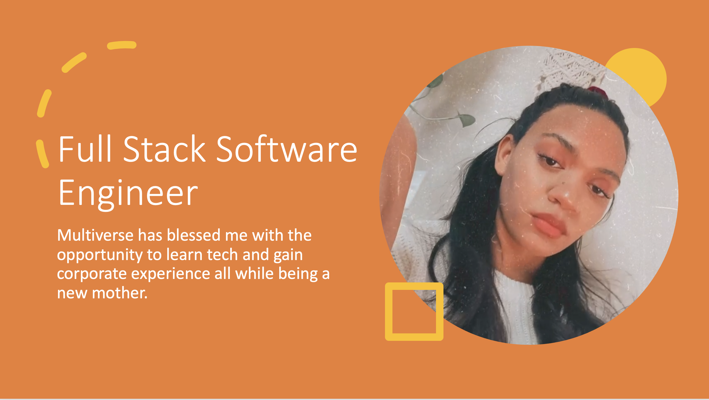

 

# Multiverse Final Portfolio
Below are some of the projects I've worked on during the apprenticeship as a jr.software engineer.

## Overview
As part of my apprenticeship program with American Express, I gained hands-on experience in software engineering through a curriculum designed and taught by Multiverse. This comprehensive program emphasized practical application, technical skills, and collaboration, providing a well-rounded foundation in the field of software development. During this apprenticeship, I worked on real-world projects, contributing to the development of scalable, secure, and user-friendly solutions. The program provided in-depth training in key areas such as object-oriented programming, cloud computing, and Agile methodologies, equipping me with the skills required for modern software engineering roles.

**Key Skills and Competencies for an Apprenticeship at American Express** 
To excel in an apprenticeship like this, a strong foundation in the following skills is essential:
1. **Programming Languages** – Proficiency in languages such as Java, Python, or JavaScript, depending on the specific team or project.
2. **Data Structures and Algorithms** – Understanding of foundational computer science concepts to build efficient software solutions.
3. **Cloud Platforms** – Familiarity with cloud computing services like AWS or Google Cloud to develop and deploy cloud-native applications.
4. **Agile Methodologies** – Experience working within Agile frameworks (Scrum or Kanban), with a focus on iterative development, collaboration, and continuous improvement.
5. **Version Control (Git)** – Knowledge of version control systems, particularly Git, to manage and track code changes collaboratively.
6. **Problem-Solving and Debugging** – The ability to identify, troubleshoot, and resolve issues during development.
7. **Teamwork and Communication** – Strong collaboration and communication skills to work effectively within cross-functional teams. 8. **Continuous Learning** – A growth mindset and the willingness to adapt and learn new technologies as required. Throughout the program, the focus was on honing these technical skills while building the soft skills necessary to thrive in a dynamic, fast-paced work environment. ---

## Projects
My projects are seperated into the following categories:

-- Cars-React app

-- Expense-Tracker-API using Java and Spring Boot 

-- Inventory-App-MySQL (full stack)

-- skrs-app (full stack)

## Contact
Coral Mejia/ coral.mejia99@gmail.com/ (917)4286007

## Acknowledgements
I would like to give my thanks to Multiverse for the incredible opportunity. To Jonathan for being an incredible, patient, and understanding coach. A week before the apprenticeship started my uncle was murdered by a family member. At the same time I was going through domestic violence at home. I was devastated and managed to learn in the bootcamp all while breastfeeding my 18 month old son at the time. Jonathans support and encouragement is what got me through that dark time and allowed me to not give up. Thanks AMEX for hiring me. And of course to myself for trying my best and working hard. This has been an incredible, humbling, and rewarding experience as a software engineer.
